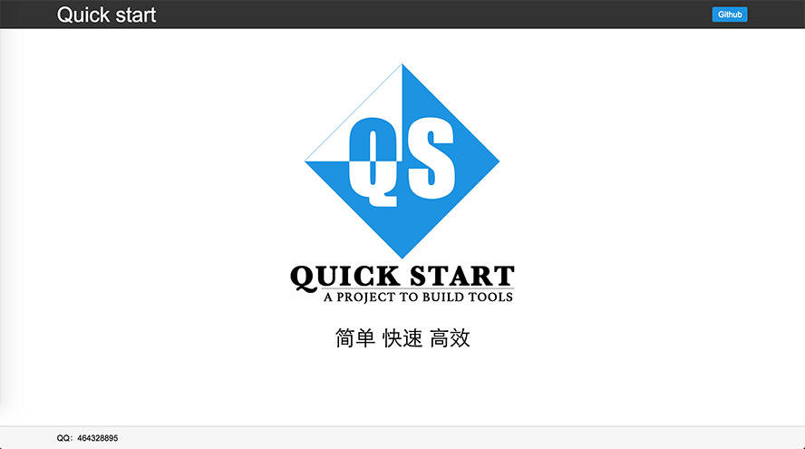

# Quick-start-cli

通过Quick-start-cli可以快速搭建一个基于webpack的前端项目



## 版本说明

### 3.1.0
增加静态资源打包发布的路径对环境变量的支持

### 3.0.0
Vue 升级到最新版  
angular 删除 doc 配置

### 2.3.16
angular项目版本升级到v5，相关配置都升级到最新

### 2.3.0
angular加入了aot优化

### 2.2.0
vue、react 升级到webpack@^2.4.0

### 2.1.0
加入了ng4热刷新功能

### 2.0.0
ng版本更新到^4.0.0，angular项目的webpack更新到^2.0.0

### 1.\*.\*

主要由webpack1 + ng2/vue2/react + less/sass/stylus来创建项目


## 脚手架特性
框架支持
- Angular
- React
- Vue

CSS预处理语言支持
- less
- sass
- stylus

其他特点
- 本地HTTP服务，不依赖后端服务
- 动态代理后端接口，实现前后端开发完全分离
- 一行命令，打包压缩

## 使用方法
### 全局安装
```bash
npm install -g quick-start-cli
```
检测是否安装成功
```bash
qs -v
```
创建一个项目，并根据控制台的提示输入相应内容
```bash
qs -c
```
比如创建一个angular的项目，整个流程如下：
```bash
创建项目：
? 请输入项目名称： my-project
? 请选择项目框架： angular
? 请选择样式表语言： sass
? 请输入版本号： 1.0.0
? 请输入作者的名称： your name
? 请输入项目简介： demo project
================================================================================
    项目名称：my-project
    项目框架：angular
  样式表语言：sass
      版本号：1.0.0
        作者：your name
    项目简介：demo project
? 请确认您的项目： Yes
================================================================================
正在创建项目……
** Reading directory for files to copy
** Reading directory for files to copy
** Glob found 21 paths
** 21 paths to copy
** 2 dirs to create
** 19 files to copy
** Glob found 42 paths
** 42 paths to copy
** 10 dirs to create
** 32 files to copy
** Directory structure created
** Directory structure created
** Files copied
--项目模板创建完成--
** Files copied
--项目配置创建完成--
项目创建完成！

```
## 安装项目依赖
进入你刚创建的项目，安装项目依赖
```bash
cd my-project
npm install
```

## 其它
启动项目
```bash
npm start
```
单元测试
```bash
npm run test
```
打包压缩
```bash
npm run build
```

运行构建后的项目
```bash
npm run production
```


